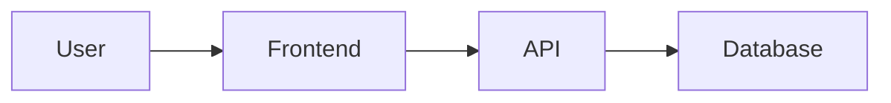

# Project Restructure - Design Document

**Version**: 1.0.0  
**Status**: 🚀 In Progress  
**Created**: December 19, 2025  
**Last Updated**: December 19, 2025

---

## Architecture Overview

### Current State Analysis

```
┌─────────────────────────────────────────────────────────────────┐
│                    CURRENT PROJECT STATE                        │
├─────────────────────────────────────────────────────────────────┤
│                                                                 │
│  ✅ WORKING (Isolated)          ❌ BLOCKED (Dependency Chain)   │
│  ├── Whale Watch                ├── UCIE (85%) ──┐              │
│  ├── News Wire                  │                │              │
│  ├── BTC/ETH Analysis           ├── ATGE ◄──────┘              │
│  ├── Authentication             │                │              │
│  ├── LunarCrush Dashboard       └── Einstein ◄───┘              │
│  └── Quantum BTC                                                │
│                                                                 │
│  📁 DOCUMENTATION SPRAWL                                        │
│  ├── 16 specs in .kiro/specs/                                   │
│  ├── 18 steering files in .kiro/steering/                       │
│  ├── 37 docs in docs/                                           │
│  └── 700+ markdown files in root                                │
│                                                                 │
└─────────────────────────────────────────────────────────────────┘
```

### Target State Architecture

```
┌─────────────────────────────────────────────────────────────────┐
│                    TARGET PROJECT STATE                         │
├─────────────────────────────────────────────────────────────────┤
│                                                                 │
│  .kiro/                                                         │
│  ├── specs/                                                     │
│  │   ├── _INDEX.md              # Master spec index             │
│  │   ├── project-restructure/   # This spec                     │
│  │   └── [16 existing specs]                                    │
│  │                                                              │
│  ├── steering/                                                  │
│  │   ├── _MASTER.md             # Master steering reference     │
│  │   └── [18 existing files]                                    │
│  │                                                              │
│  ├── knowledge/                 # NEW: Knowledge Bank           │
│  │   ├── patterns/              # Reusable code patterns        │
│  │   ├── decisions/             # Architecture Decision Records │
│  │   └── flows/                 # Data flow diagrams            │
│  │                                                              │
│  └── registry/                  # NEW: Feature Registry         │
│      └── features.json          # Feature status tracking       │
│                                                                 │
│  docs/                                                          │
│  ├── production-features/       # NEW: Working feature docs     │
│  │   ├── whale-watch.md                                         │
│  │   ├── news-wire.md                                           │
│  │   ├── btc-eth-analysis.md                                    │
│  │   └── authentication.md                                      │
│  └── [existing docs]                                            │
│                                                                 │
└─────────────────────────────────────────────────────────────────┘
```

---

## Component Design

### 1. Production Feature Documentation

**Location**: `docs/production-features/`

**Template Structure**:
```markdown
# [Feature Name] - Production Documentation

## Overview
Brief description of the feature.

## Status
✅ PRODUCTION READY

## Architecture
- Components involved
- Data flow diagram
- API endpoints

## API Endpoints
| Endpoint | Method | Description |
|----------|--------|-------------|
| /api/... | GET    | ...         |

## Data Flow


## Configuration
Environment variables required.

## Troubleshooting
Common issues and solutions.

## Related Files
- Component files
- API files
- Test files
```

### 2. UCIE Context Aggregator Analysis

**Current Implementation** (`lib/ucie/contextAggregator.ts`):

```typescript
// formatContextForAI() - CURRENT STATE
export function formatContextForAI(context: ComprehensiveContext): string {
  let prompt = `# Comprehensive Analysis Context for ${context.marketData?.symbol || 'Unknown'}\n\n`;
  // ... builds markdown prompt with all data sources
  return prompt;
}
```

**Analysis**:
The `formatContextForAI()` function is well-implemented and produces a comprehensive markdown prompt. The issue is likely in:

1. **Data Quality**: Not enough data sources available (< 70%)
2. **GPT-5.1 Integration**: The prompt may not be reaching GPT-5.1 correctly
3. **Auto-Start Logic**: Phase 2 may not be triggering after Phase 1

**Investigation Points**:
- Check `components/UCIE/DataPreviewModal.tsx` for auto-start logic
- Check `pages/api/ucie/openai-summary-start/[symbol].ts` for GPT-5.1 call
- Verify data quality score calculation

### 3. Spec Index Design

**Location**: `.kiro/specs/_INDEX.md`

**Structure**:
```markdown
# Kiro Specs Index

## Quick Navigation
| Spec | Status | Priority | Dependencies |
|------|--------|----------|--------------|
| UCIE | 85% | HIGH | None |
| ATGE | Blocked | HIGH | UCIE |
| Einstein | Blocked | HIGH | ATGE |

## By Status
### ✅ Complete
- whale-watch
- authentication

### 🔄 In Progress
- universal-crypto-intelligence (UCIE)
- project-restructure

### ⏸️ Blocked
- ai-trade-generation-engine (ATGE)
- einstein-trade-engine

### 📦 Deprecated
- (none currently)

## By Feature Area
### Trading Intelligence
- ai-trade-generation-engine
- einstein-trade-engine
- quantum-btc-super-spec

### Data & Analysis
- universal-crypto-intelligence
- ucie-veritas-protocol

### User Interface
- bitcoin-sovereign-rebrand
- mobile-optimization
- mobile-tablet-visual-fixes

### Security
- secure-user-authentication
- user-authentication-system
```

### 4. Steering Master Reference Design

**Location**: `.kiro/steering/_MASTER.md`

**Structure**:
```markdown
# Kiro Steering Master Reference

## 🚨 Critical Rules (Read First)
1. **UCIE System** (`ucie-system.md`)
   - AI analysis happens LAST
   - Database is source of truth
   - Use utility functions

2. **Data Quality** (`data-quality-enforcement.md`)
   - 99% accuracy or nothing
   - No fallback data

## Priority Index
### P0 - Critical
- ucie-system.md
- KIRO-AGENT-STEERING.md
- data-quality-enforcement.md

### P1 - High
- api-integration.md
- openai-integration.md
- authentication.md

### P2 - Medium
- STYLING-SPEC.md
- mobile-development.md
- bitcoin-sovereign-design.md

### P3 - Low
- git-workflow.md
- date-management.md
```

### 5. Knowledge Bank Design

**Location**: `.kiro/knowledge/`

**Structure**:
```
.kiro/knowledge/
├── patterns/
│   ├── api-endpoint-pattern.md      # Standard API endpoint structure
│   ├── cache-first-pattern.md       # Database cache pattern
│   ├── ai-analysis-pattern.md       # AI integration pattern
│   └── error-handling-pattern.md    # Error handling pattern
│
├── decisions/
│   ├── ADR-001-database-cache.md    # Why Supabase over in-memory
│   ├── ADR-002-gpt-model-choice.md  # Why chatgpt-4o-latest for UCIE
│   ├── ADR-003-session-auth.md      # Why session-only auth
│   └── ADR-004-vercel-pro.md        # Why Vercel Pro timeouts
│
└── flows/
    ├── ucie-data-flow.md            # UCIE complete data flow
    ├── auth-flow.md                 # Authentication flow
    ├── whale-watch-flow.md          # Whale Watch flow
    └── deployment-flow.md           # CI/CD deployment flow
```

### 6. Feature Registry Design

**Location**: `.kiro/registry/features.json`

**Schema**:
```json
{
  "version": "1.0.0",
  "lastUpdated": "2025-12-19T00:00:00Z",
  "features": [
    {
      "id": "whale-watch",
      "name": "Whale Watch Intelligence",
      "status": "working",
      "completion": 100,
      "dependencies": [],
      "spec": ".kiro/specs/whale-watch/",
      "components": [
        "components/WhaleWatch/WhaleWatchDashboard.tsx"
      ],
      "apis": [
        "/api/whale-watch/detect",
        "/api/whale-watch/analyze"
      ],
      "lastUpdated": "2025-12-19T00:00:00Z"
    },
    {
      "id": "ucie",
      "name": "Universal Crypto Intelligence Engine",
      "status": "in-progress",
      "completion": 85,
      "dependencies": [],
      "blockedBy": null,
      "blocking": ["atge", "einstein"],
      "spec": ".kiro/specs/universal-crypto-intelligence/",
      "lastUpdated": "2025-12-19T00:00:00Z"
    },
    {
      "id": "atge",
      "name": "AI Trade Generation Engine",
      "status": "blocked",
      "completion": 0,
      "dependencies": ["ucie"],
      "blockedBy": "ucie",
      "blocking": ["einstein"],
      "spec": ".kiro/specs/ai-trade-generation-engine/",
      "lastUpdated": "2025-12-19T00:00:00Z"
    }
  ]
}
```

---

## Data Flow Diagrams

### UCIE Critical Path

```
┌─────────────────────────────────────────────────────────────────┐
│                    UCIE DATA FLOW                               │
├─────────────────────────────────────────────────────────────────┤
│                                                                 │
│  Phase 1: Data Collection (60-120s)                             │
│  ┌─────────────────────────────────────────────────────────┐    │
│  │  User clicks "Get Preview"                               │    │
│  │           ↓                                              │    │
│  │  ┌─────────────────────────────────────────────────┐    │    │
│  │  │  Parallel API Calls (13 sources)                │    │    │
│  │  │  ├── Market Data (CoinGecko, CMC, Kraken)       │    │    │
│  │  │  ├── Sentiment (Fear & Greed, LunarCrush)       │    │    │
│  │  │  ├── Technical (RSI, MACD, EMA)                 │    │    │
│  │  │  ├── News (NewsAPI, CryptoCompare)              │    │    │
│  │  │  └── On-Chain (Etherscan, Blockchain.com)       │    │    │
│  │  └─────────────────────────────────────────────────┘    │    │
│  │           ↓                                              │    │
│  │  ┌─────────────────────────────────────────────────┐    │    │
│  │  │  setCachedAnalysis() → Supabase Database        │    │    │
│  │  └─────────────────────────────────────────────────┘    │    │
│  └─────────────────────────────────────────────────────────┘    │
│                                                                 │
│  Phase 2: GPT-5.1 Analysis (60-100s) - AUTO-STARTS              │
│  ┌─────────────────────────────────────────────────────────┐    │
│  │  getComprehensiveContext() → Fetch all cached data      │    │
│  │           ↓                                              │    │
│  │  Check dataQuality >= 70%                                │    │
│  │           ↓                                              │    │
│  │  formatContextForAI() → Build prompt                     │    │
│  │           ↓                                              │    │
│  │  Call GPT-5.1 (chatgpt-4o-latest)                        │    │
│  │           ↓                                              │    │
│  │  setCachedAnalysis('gpt-analysis') → Store result        │    │
│  └─────────────────────────────────────────────────────────┘    │
│                                                                 │
│  Phase 3: Caesar Research (15-20 min) - MANUAL START            │
│  ┌─────────────────────────────────────────────────────────┐    │
│  │  User clicks "Start Caesar Deep Dive"                    │    │
│  │           ↓                                              │    │
│  │  formatContextForAI() with GPT analysis included         │    │
│  │           ↓                                              │    │
│  │  Call Caesar API                                         │    │
│  │           ↓                                              │    │
│  │  setCachedAnalysis('research') → Store result            │    │
│  └─────────────────────────────────────────────────────────┘    │
│                                                                 │
└─────────────────────────────────────────────────────────────────┘
```

---

## Implementation Strategy

### Phase 1: Documentation (2 hours)

1. Create `docs/production-features/` directory
2. Write 4 production feature docs
3. Create `.kiro/specs/_INDEX.md`
4. Create `.kiro/steering/_MASTER.md`

### Phase 2: UCIE Investigation & Fix (4 hours)

1. Add logging to identify exact failure point
2. Verify data quality calculation
3. Check GPT-5.1 auto-start logic
4. Test end-to-end flow
5. Fix identified issues

### Phase 3: Infrastructure (2 hours)

1. Create `.kiro/knowledge/` structure
2. Create `.kiro/registry/features.json`
3. Update `vercel.json` for preview deployments

---

## Testing Strategy

### Unit Tests
- `formatContextForAI()` output validation
- Data quality calculation accuracy
- Cache utility functions

### Integration Tests
- UCIE end-to-end flow
- GPT-5.1 analysis completion
- Caesar research completion

### Manual Tests
- Preview deployment verification
- Documentation accuracy review
- Feature registry validation

---

## Rollback Plan

If restructuring causes issues:

1. **Documentation**: Can be reverted via git
2. **UCIE Fix**: Isolated to `lib/ucie/contextAggregator.ts`
3. **Infrastructure**: New files only, no existing file modifications

---

## References

- `.kiro/steering/ucie-system.md` - UCIE system rules
- `lib/ucie/contextAggregator.ts` - Context aggregation code
- `components/UCIE/DataPreviewModal.tsx` - UCIE frontend
- `pages/api/ucie/openai-summary-start/[symbol].ts` - GPT-5.1 API
